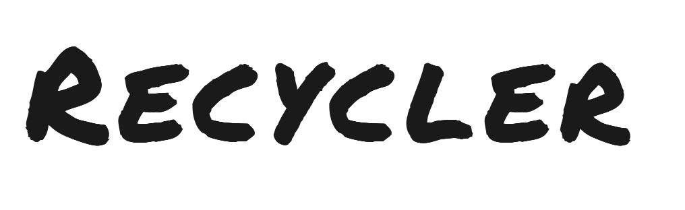
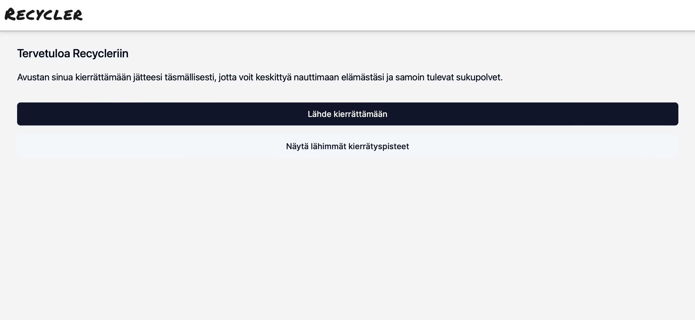
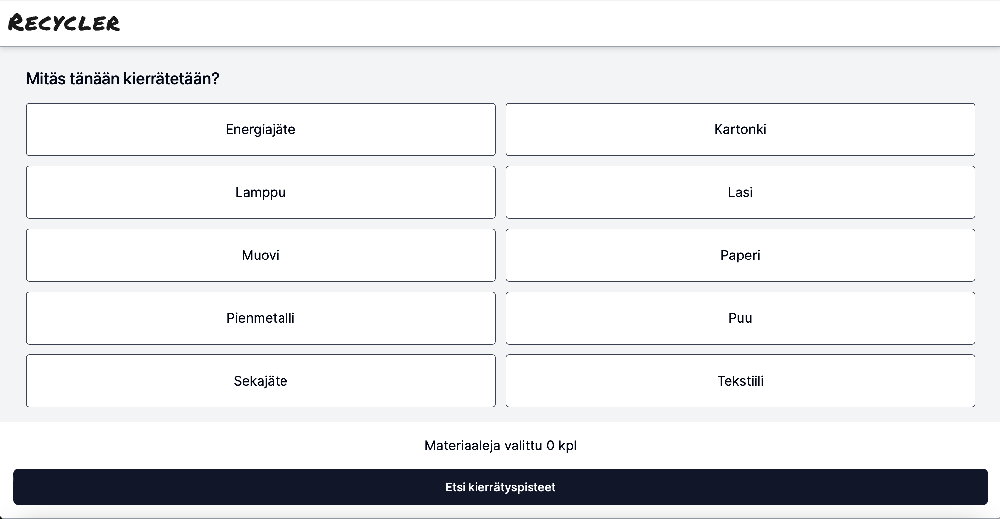
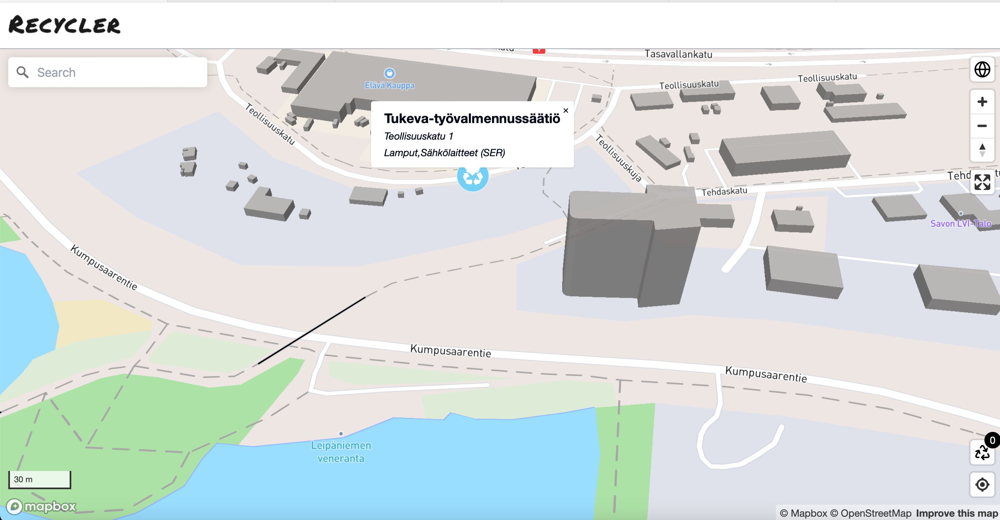

## Overview

_With ReCycler, it’s easier than you think!_

ReCycler is an open-source platform aimed at creating a more modern and user-centric recycling service, building upon the foundation of the existing kierrätys.info. ReCycler platform leverages the kierrätys.info API (https://api.kierratys.info/) to obtain basic information about recycling collection spots. Additionally, the service utilizes Mapbox's mapping and location-based APIs. The idea of the platform is to provide solutions to various use cases efficiently and seamlessly.
## Features
### User-friendly interface for smart recycling guidance
ReCycler offers an intuitive interface with a map view to visualize the locations of suitable/recommended recycling points, their directions, accessibility, and other relevant details. The service is also possible to use without a map through a menu-based solution. For example, a user can inquire about the proper disposal method for items like car batteries, metal, cardboard or glass.
## Future possible enhancements
### Mobile Application
While initially a web-based service, Recycler plans to develop a mobile application for a seamless user experience on smartphones.
### AI-powered interface
In later stages, ReCycler will introduce an AI-based chat function as the primary interface for users. Initially, a map-based interface prompts users to specify their recycling items. The end user receives the desired service through the chat, eliminating the need to consult multiple information sources.
In future releases, users can describe recyclable items through photos taken with their mobile devices. ReCycler then suggests suitable recycling methods based on the submitted images.
### Gamification
The project aims to incorporate gamification elements, including statistics and rewards for recycling activities, encouraging users to participate in the recycling process actively.
## How to contribute
We welcome contributions from developers, designers, and anyone passionate about sustainable practices. To contribute, please follow the guidelines outlined in our [contributing.md](contributing.md) file.
## Installation
To set up ReCycler locally, refer to our [installation.md](installation.md) for detailed instructions.
## License
ReCycler is open-source and distributed under the [Apache-2.0 license](licence.md). Please feel free to use, modify, and distribute the software according to the terms of the license.
## Contact
For any inquiries or suggestions, please reach out to us through GitHub. You can contact us by creating an issue in the repository, participating in discussions, or submitting pull requests. We value and welcome your contributions and feedback.
Let's collaborate to create a more sustainable future with ReCycler! :seedling::recycle:
## GUI screenshots 26.6.2024

